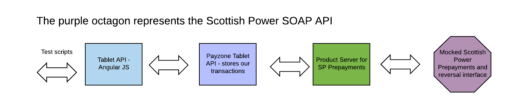

# Mock Soap API for the Scottish Power API

This node server acts as a mock up of the Scottish Power 251-252 and 253-254 SOAP interfaces.

Its a development tool that should allow us to work on the project before the actual API is ready.

The WSDL descriptions of the SOAP API and are in the docs directory.

The API is described in flow charts and documents the same place.

The SOAP functionality is provided by a couple of modules called [node-soap](https://github.com/vpulim/node-soap) and [soap](https://github.com/RobinBuschmann/express-soap)

In the diagram below, the purple octagon represents this server.



## Install

npm run build


## How to start

npm start 

## How to use

From curl or Postman,  POST the following json to http://localhost:3090/scottish-power-251 


```xml

&lt;soapenv:Envelope xmlns:soapenv="http://schemas.xmlsoap.org/soap/envelope/"&gt;
   &lt;soapenv:Header/&gt;
   &lt;soapenv:Body&gt;
     &lt;Message&gt;
          &lt;MT_PrepaymentRequestInput_251&gt;
            &lt;ExternalID&gt;PayzoneXYZ&lt;/ExternalID&gt;
            &lt;PaymentIdentifier&gt;1234567765432&lt;/PaymentIdentifier&gt;
            &lt;PaymentSource&gt;S&lt;/PaymentSource&gt;
            &lt;Amount&gt;1112.00&lt;/Amount&gt;
          &lt;/MT_PrepaymentRequestInput_251&gt;
      &lt;/Message&gt;
   &lt;/soapenv:Body&gt;
&lt;/soapenv:Envelope&gt;

```

Also for comparison http://localhost:3090/calculator

```xml
&lt;soapenv:Envelope xmlns:soapenv="http://schemas.xmlsoap.org/soap/envelope/"&gt;
  &lt;soapenv:Header/&gt;
   &lt;soapenv:Body&gt;
      &lt;Add&gt;
      	&lt;a&gt;222&lt;/a&gt;
      	&lt;b&gt;3&lt;/b&gt;
      &lt;/Add>
   &lt;/soapenv:Body&gt;
&lt;/soapenv:Envelope&gt;
```

## Environment variables

This is where the SOAP 252 reply will go to
PRODUCT_SERVER_URL=http://localhost:3020

WSDL_252=/two_five_two?wsdl

## Testing

npm run build

This shows that the SOAP API replies to a request

npm run test